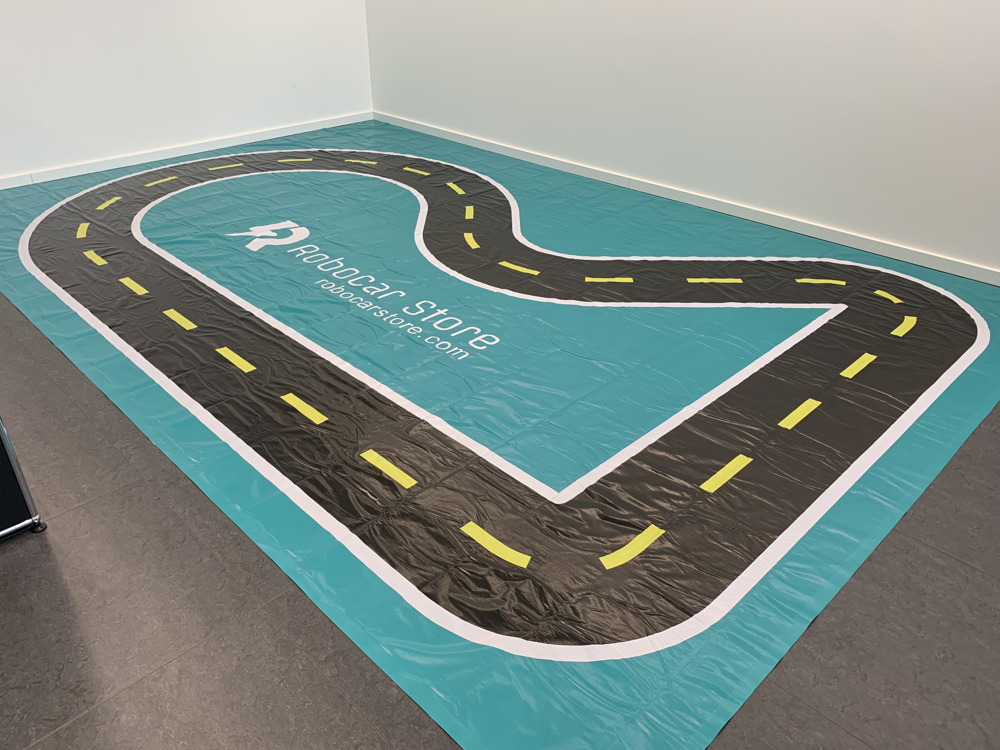
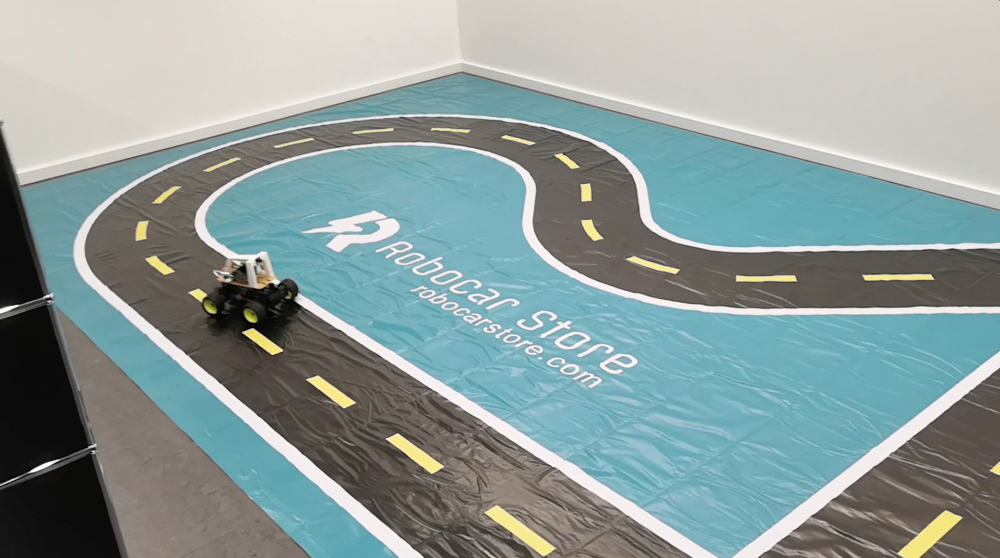
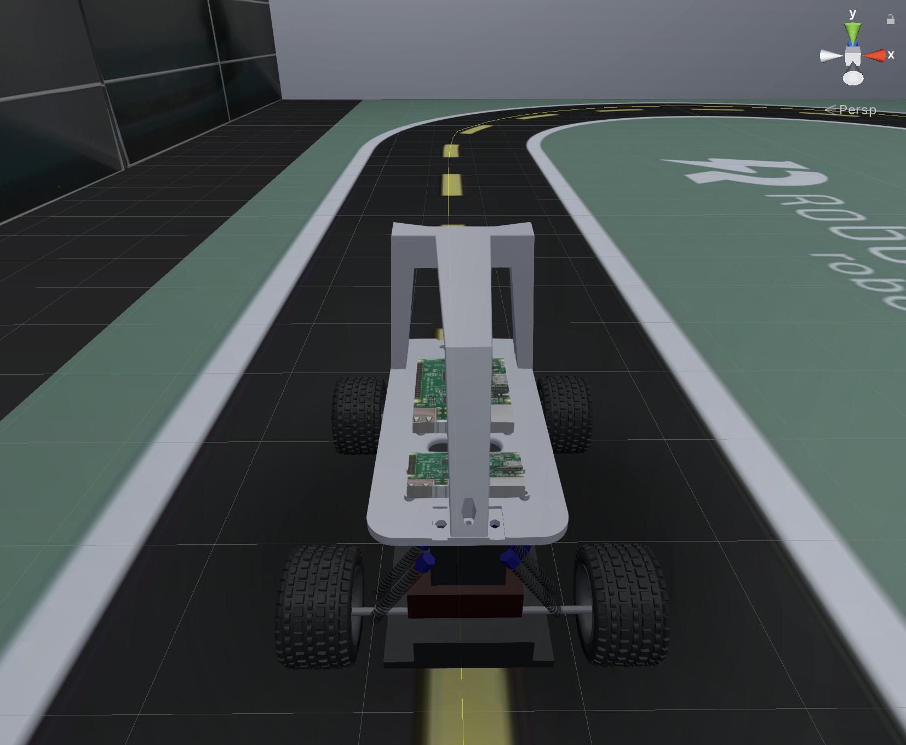
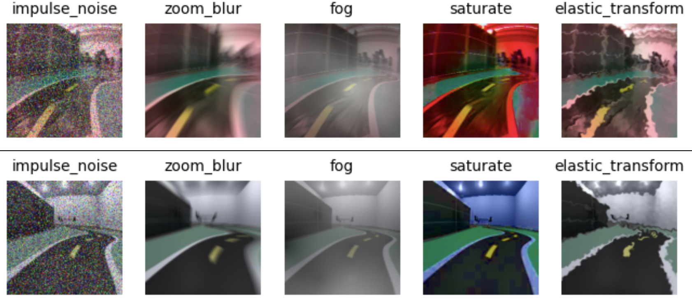

# Code Artifacts
Code artifacts for the submission "Mind the Gap! A Study on the Transferability of Virtual vs Physical-world Testing of Autonomous Driving Systems"

## Demos

### Testbed

*Real-world Environment*





*Virtual Environment (Unity)*





*Sim2Real and Real2Sim translations by CycleGAN*


### Self-driving cars

*The same DNN model deployed on a real-world electric vehicle and in a virtual simulated world*


### Visual Odometry

*Real-time XTE predictions in the real-world with visual odometry*


*Corruptions (left) and Adversarial Examples (right)*




## Requisites
Python3, git 64 bit, miniconda 3.7 64 bit.
To modify the simulator (optional): Unity 2019.3.0f1

**Software setup:** We adopted the PyCharm Professional 2020.3, a Python IDE by JetBrains, and Python 3.7.

**Hardware setup:** Training the DNN models (self-driving cars) and CycleGAN on our datasets is computationally expensive. Therefore, we recommend using a machine with a GPU. In our setting, we ran our experiments on a machine equipped with a AMD Ryzen 5 processor, 8 GB of memory, and an NVIDIA GPU GeForce RTX 2060 with 6 GB of dedicated memory. Our trained models are available [here](https://drive.google.com/drive/folders/1WMgGCNbQPXpaaipOqopgmtWxqgBu0Xuo?usp=sharing).

## Donkey Car

We used Donkey Car v. 3.1.5. Make sure you correctly install the [donkey car software](http://docs.donkeycar.com/guide/install_software/), the necessary [simulator software](http://docs.donkeycar.com/guide/simulator/) and [our simulator](https://drive.google.com/drive/folders/1WMgGCNbQPXpaaipOqopgmtWxqgBu0Xuo?usp=sharing) (<b>macOS</b> only).

```
* git clone https://github.com/autorope/donkeycar.git
* git checkout a91f88d
* conda env remove -n donkey
* conda env create -f install/envs/mac.yml
* conda activate donkey
* pip install -e .\[pc\]
```

## XTE Predictor for real-world driving images

Data collection for a XTE predictor must be collected manually (or our datasets can be used). Alternatively, data can be collected by:
<ol>
    <li>Launching the Simulator.</li>
    <li>Selecting a log directory by clicking the 'log dir' button</li>
    <li>Selecting a preferred resolution (default is 320x240)</li>
    <li>Launching the Sanddbox Track scene and drive the car with the 'Joystick/Keyboard w Rec' button</li>
    <li>Driving the car</li>
</ol>


This will generate a dataset of simulated images and respective XTEs (labels). The simulated images have then to be converted using a CycleGAN network trained to do sim2real translation. 

Once the dataset of converted images and XTEs is collected, use the `train_xte_predictor.py` notebook to train the xte predictor.

## Self-Driving Cars

### Manual driving

*Connection*

Donkey Car needs a static IP so that we can connect onto the car

```
ssh jetsonnano@<your-IP>
Pwd: <password>
```

*Joystick Pairing*

```
ds4drv &
```

PS4 controller: press PS + share and hold; starts blinking and pairing
If [error][bluetooth] Unable to connect to detected device: Failed to set operational mode: [Errno 104] Connection reset by peer
Try again
When LED is green, connection is ok

```
python manage.py drive —js  // does not open web UI
```

```
python manage.py drive  // does open web UI for settiong a maximum throttle value
```

X -> E-Stop (negative acceleration)
Share -> change the mode [user, local, local_angle]

Enjoy!

press PS and hold for 10 s to turn it off

*Training*

```
python train.py --model <modelname>.h5 --tub <data> --type <modeltype> --aug
```

*Testing (nominal conditions)*

For autonomus driving:

```
python manage.py drive --model [models/<model-name.h5>]
```
Go to: http://10.21.13.35:8887/drive
Select “Local Pilot (d)”

*Testing (corrupted conditions)*

```
python manage.py drive --model [models/<model-name.h5>] [--corruption=<corruption>] [--severity=<severity>] [--delay=<delay>]
```

*Testing (adversarial conditions)*

```
python manage.py drive --model [models/<model-name.h5>] [--useadversarial] [--advimage=<file>]  [--severity=<severity>] [--delay=<delay>]
```
